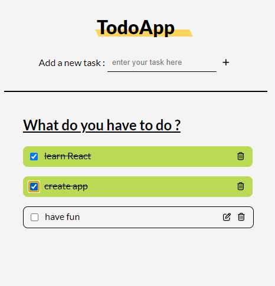

# DoItNow 📝

## About the Project :
DoItNow is a application to lists all the things you have to do.



### Built with : 
* React - 
* Vite - 
* Sass - 

## Getting Started
Here's how to install this project in local ⬇️

### Preresquisites 
Before you start, make sure you have Node.js installed → [Click here to install ](https://nodejs.org/en/download)

### Installation
1. Clone the repo :
    ``` sh
    git clone git@github.com:casl0x/todolist.git
    ```
2. Install NPM packages :
    ```sh
    npm install
    ```
3. Start your local development server :
    ```sh
   npm run dev 
   ```
4. Have fun ;) 

## Features
- [x] Add a new task to the list
- [x] Edit and delete button for each task 
- [ ] Filter your task
- [ ] Button to delete all completed tasks
